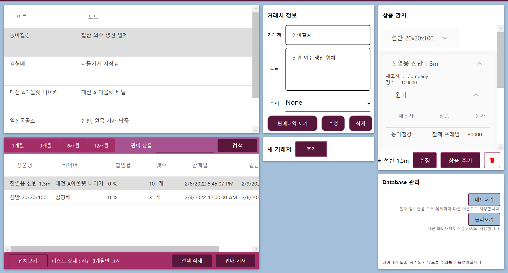

# OpenERP
You can download Epe.Xaml from
[here](https://github.com/SnowyPainter/OpenERP/releases/tag/1.1).



# Custom program
contact me for starting from 150,000KRW  
snowypainter@gmail.com

# Functions
fundamental system is below:  
1. Add My clients and suppliers. 
2. Add My Item
3. Write Sales
4. Get the database and analysis.

## Elastic language changing

All of texts in Epe.Xaml is dynamically ran on LangPack.dll. So edit ```Lp``` Label to custom language package from ```settings.ini``` in same path as execute file.